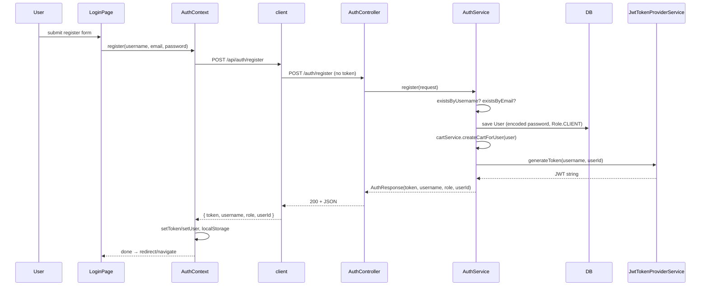
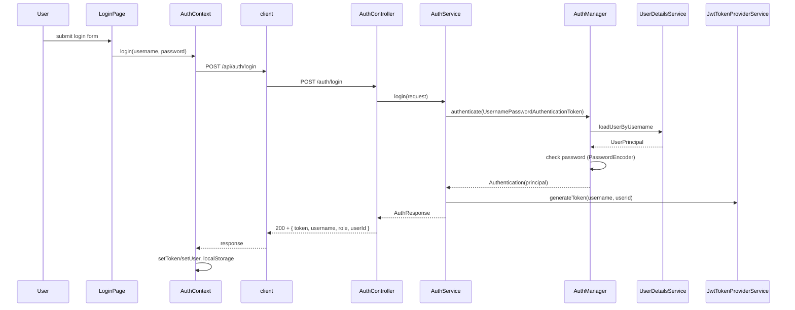
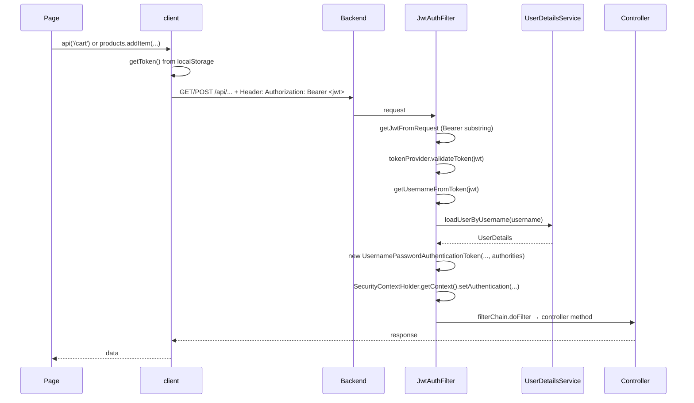
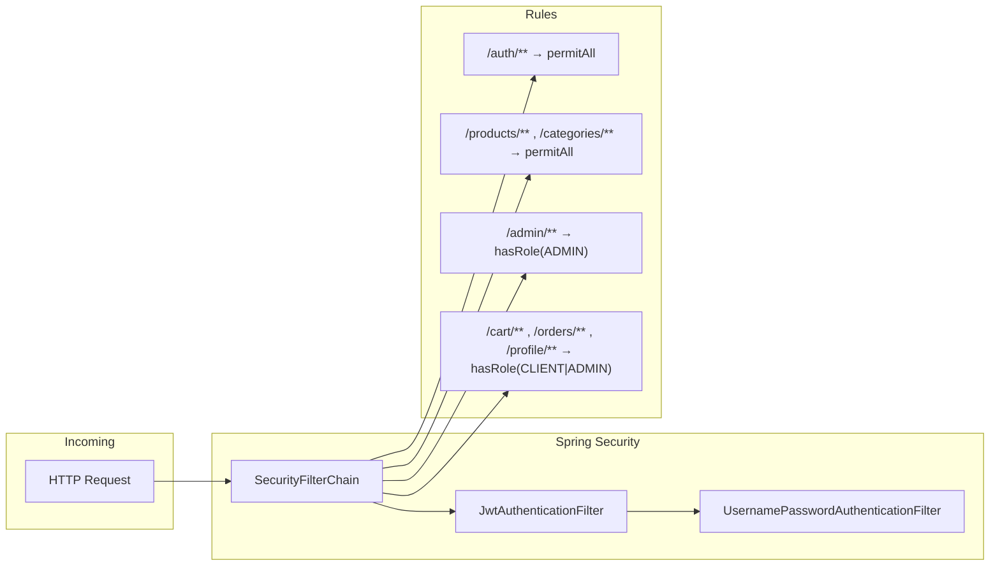
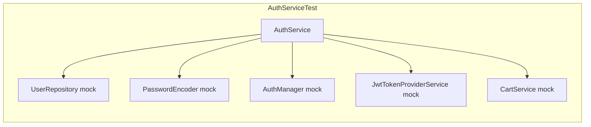
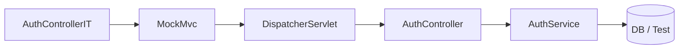
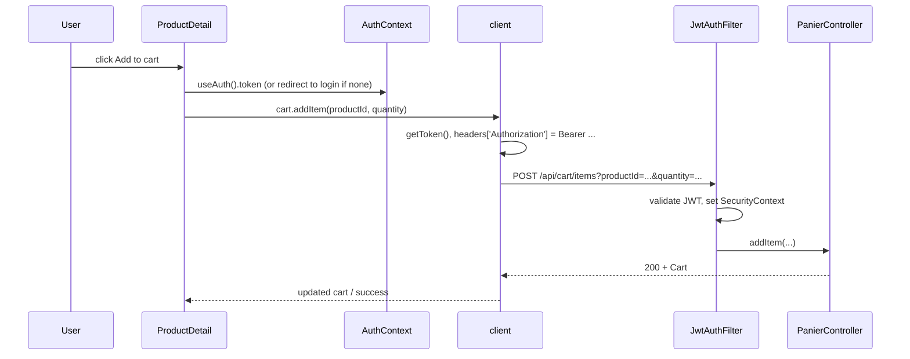

Here’s how the project is structured and how the main flows work, with simple visual workflows.

---

## 1. Project layout

The app is a **React (Vite) frontend** talking to a **Spring Boot backend** over HTTP. The backend is under `/api` (context path).

```
┌─────────────────────────────────────────────────────────────────────────────┐
│  Frontend (Vite/React, port 5173)                                            │
│  • AuthContext → login/register, token & user in state + localStorage         │
│  • api/client.ts → fetch to /api/* with Bearer token                         │
│  • Vite proxy: /api → http://localhost:8081                                  │
└─────────────────────────────────────────────────────────────────────────────┘
                                        │
                                        ▼
┌─────────────────────────────────────────────────────────────────────────────┐
│  Backend (Spring Boot, port 8081, context-path: /api)                        │
│  • SecurityConfig: public vs protected routes, JWT filter                    │
│  • JwtAuthenticationFilter → extract Bearer → validate → set SecurityContext  │
│  • AuthController → /auth/register, /auth/login → AuthService → JWT          │
│  • Other controllers: products, cart, orders, admin...                       │
└─────────────────────────────────────────────────────────────────────────────┘
```

---

## 2. Auth workflow

### Register



- **Backend:** `AuthController.register` → `AuthService.register`: validate uniqueness, save user, create cart, generate JWT, return `AuthResponse`.
- **Frontend:** `AuthContext.register` calls `authApi.register` (in `client.ts`), then stores token and user in state and `localStorage`.

### Login



- **Backend:** `AuthController.login` → `AuthService.login` → `AuthenticationManager` (with `UserDetailsService` + `PasswordEncoder`) → on success, build JWT via `JwtTokenProviderService` and return `AuthResponse`.
- **Frontend:** Same as register: `AuthContext.login` → `authApi.login` → store token and user.

### Authenticated request (any protected API)



- **Frontend:** `api()` in `client.ts` always adds `Authorization: Bearer <token>` when `localStorage.token` exists.
- **Backend:** Every request goes through `JwtAuthenticationFilter`: read Bearer token → validate JWT → load user → set `SecurityContext` → rest of the chain (controllers) see the authenticated user.

So: **auth** = register/login return JWT; **later calls** = client sends JWT; **backend** = filter validates JWT and sets Spring Security context.

---

## 3. Security and request routing (backend)



- **SecurityConfig** builds the chain: CSRF disabled, stateless session, CORS, then route rules.
- **JwtAuthenticationFilter** runs first: if there’s a valid Bearer JWT, it sets `SecurityContext`; if not, the context stays empty.
- **Route rules:**  
  - `/auth/**`, `/products/**`, `/categories/**` → no auth.  
  - `/admin/**` → must have role ADMIN.  
  - `/cart/**`, `/orders/**`, `/profile/**` → must have CLIENT or ADMIN.

So “how auth works” in practice: **auth endpoints** are public; **protected endpoints** require a valid JWT that the filter has turned into an `Authentication` in `SecurityContext`.

---

## 4. Tests

### Backend (Java)

- **Unit tests (Mockito):** one class under test, dependencies mocked.  
  Example: `AuthServiceTest` mocks `UserRepository`, `PasswordEncoder`, `AuthenticationManager`, `JwtTokenProviderService`, `CartService` and checks `register`/`login` return values and thrown exceptions.



- **Integration tests (MockMvc + SpringBootTest):** full context, real (or test) DB, HTTP layer.  
  Example: `AuthControllerIT` calls `POST /api/auth/register` and `POST /api/auth/login` and asserts status and JSON (e.g. `token`, `username`, `role`).



So: **auth** is tested at service level (unit) and at HTTP level (integration). Other areas (products, cart, orders, etc.) follow the same pattern (unit for services, IT for controllers if present).

### Frontend (Vitest + React Testing Library)

- **Vitest** runs tests; **React Testing Library** renders components and queries the DOM.
- Example: `AuthContext.test.tsx` renders `AuthProvider` and a consumer that reads `user` from `useAuth()`, and asserts initial state (e.g. `user` null or “none”).
- `Home.test.tsx` and similar files test pages in isolation (and can mock `useAuth` or API if needed).

```mermaid
flowchart LR
  Vitest --> RTL[React Testing Library]
  RTL --> Render[render(Component)]
  Render --> Screen[screen queries]
  Screen --> Expect[expect(...)]
```

So: **tests** on the frontend are component/context tests with Vitest and RTL; they don’t call the real backend (you’d mock `authApi` or `api` for that).

---

## 5. End-to-end flow (one example: “add to cart”)



- **Auth:** If the user is logged in, `AuthContext` holds the token and `client` sends it; if not, the app can redirect to login (e.g. via `PrivateRoute` for `/cart`).
- **Backend:** Only the JWT filter and controller are in play; no separate “auth” call for this request.

---

## Summary

| Area | How it works |
|------|----------------|
| **Auth** | Register/Login via `AuthController` → `AuthService` → JWT from `JwtTokenProvider`/`JwtTokenProviderService`. Frontend stores token and user in `AuthContext` and `localStorage`. |
| **Protected calls** | `client.ts` adds `Authorization: Bearer <token>`. `JwtAuthenticationFilter` validates JWT, loads user, sets `SecurityContext`. Routes are enforced by `SecurityConfig` (roles). |
| **Tests** | Backend: unit tests (services with mocks), integration tests (MockMvc vs `/api/...`). Frontend: Vitest + RTL for components and context. |

If you tell me which part you want to go deeper into (e.g. only auth, only tests, or a specific file), I can stick to that and keep the same visual style.